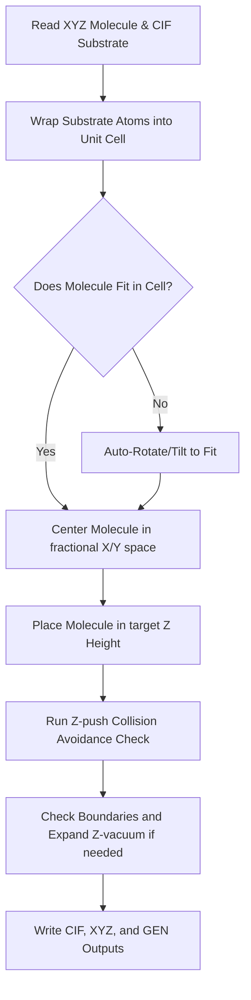

# PyHyB: Hybrid Material Builder

PyHyB is a high-performance Python package designed to construct complex hybrid configurations by combining molecular structures (`.xyz`) with periodic substrates (`.cif`) using the Atomic Simulation Environment (ASE). It includes robust algorithms for unit-cell wrapping, molecule centering, out-of-plane tilting, collision avoidance, Z-axis cell expansion, and optional DFTB+ geometry relaxation.

---

## 📖 Table of Contents
1. [⚡ Quick-Start (1-Click Universal Launcher)](#quick-start-1-click-universal-launcher)
2. [🖥️ Application Interfaces](#application-interfaces)
3. [🛠️ Manual Installation & DFTB+ Setup](#manual-installation--dftb-setup)
4. [🧠 Underlying Workflow Operations](#underlying-workflow-operations)
5. [🚀 Verification Examples](#verification-examples)
6. [🧪 Running Unit Tests & Quality Controls](#running-unit-tests--quality-controls)

---

## ⚡ Quick-Start (1-Click Universal Launcher)

PyHyB features an **automated, cross-platform bootstrapper** that checks for Python, installs it automatically if missing on your system, creates a virtual environment, installs the package, and opens a premium **Interactive 3D Web GUI** or runs tests and examples in one click.

### 🍎 On macOS & Linux:
1. Open your terminal in the cloned repository folder.
2. Run the launcher:
   ```bash
   ./run.sh
   ```

### 🔌 On Windows:
1. Open your file explorer in the cloned repository folder.
2. Double-click the launcher script at the root of the folder:
   ```cmd
   run.bat
   ```

Once launched, an interactive terminal menu will let you choose to:
* **Option 1**: Start the Interactive 3D Web GUI in your browser. 🚀
* **Option 2**: Start the Custom Interactive Hybrid Builder. 🔨
* **Option 3**: Run Example 1 (Glycine deposition on Graphene). 🧪
* **Option 4**: Run Example 2 (Crown Ether deposition on Graphene). 🍩
* **Option 5**: Run Example 3 (Cucurbituril deposition on Graphene Oxide). 🛡️
* **Option 6**: Run the built-in Unit Tests to verify installation. 🧪
* **Option 7**: Exit the launcher. 🚪

---

## 🖥️ Application Interfaces

### 1. Interactive 3D Web GUI (Streamlit)
Launch the GUI via Option 1 in the 1-click launcher. It opens a clean, default-dark web portal in your browser:
* **Drag-and-Drop Uploader**: Upload your `.xyz` macromolecule and `.cif` substrate.
* **Interactive 3D Previews**: Rotate, zoom, and verify structures in real time.
* **Parameter Sliders**: Easily adjust starting heights, collision thresholds, and COM rotation angles.
* **Download Portal**: Download constructed hybrid structures in `.cif`, `.xyz`, or `.gen` format with one click.
* **Benchmark Presets**: Instant load buttons to preview Glycine, Crown Ether, or Cucurbituril deposition.

### 2. Command-Line Interface (CLI)

PyHyB offers two ways to run from the command line:

#### A. Global CLI Script (`pyhyb`)
If you have installed the package via pip (`pip install -e .`), you can invoke the CLI globally:
```bash
pyhyb -m material.xyz -s substrate.cif -o custom_output_folder --placement surface --distance 3.0 --rotation 90 0 180 --collision-threshold 1.5 --optimize -v
```

##### 🚩 Command-Line Arguments:
*   **`-m / --material`**: Macromolecule filename in `input/` or a direct path (e.g., `material.xyz`).
*   **`-s / --substrate`**: Periodic substrate filename in `input/` or a direct path (e.g., `substrate.cif`).
*   **`-o / --outdir`**: Destination folder for output files (defaults to `output/`).
*   **`--placement`**: Center molecule in unit cell (`center`) or place above substrate peak (`surface`). Defaults to `center`.
*   **`--distance`**: Starting height above the surface in Ångströms (defaults to `3.0`).
*   **`--rotation X Y Z`**: COM rotation angles in degrees (e.g., `--rotation 90 0 180`).
*   **`--collision-threshold`**: Minimum allowed inter-atomic distance (defaults to `1.5 Å`).
*   **`--optimize`**: Triggers the DFTB+ Geometric Optimization pipeline to relax the final structure.
*   **`-v / --verbose`**: Enables detailed verbose logging.

#### B. Launcher CLI Mode (`python launcher.py`)
Alternatively, you can run directly via the launcher's non-interactive CLI by providing the required arguments:
```bash
python launcher.py -m example/data/glycine.xyz -s example/data/graphene_7x7.cif -o custom_output -p surface -d 3.0 -t 1.5 -r 90 0 180 --optimize
```

##### 🚩 Arguments:
*   **`-m / --material`**: Path to macromolecule `.xyz` structure file.
*   **`-s / --substrate`**: Path to periodic substrate `.cif` structure file.
*   **`-o / --outdir`**: Output directory for generated structures (default: `output/`).
*   **`-p / --placement`**: Macromolecule placement logic (`center` or `surface`, default: `center`).
*   **`-d / --distance`**: Starting vertical separation distance in Å (default: `3.0`).
*   **`-t / --threshold`**: Collision detection threshold in Å (default: `1.5`).
*   **`-r / --rotation`**: 3D Euler rotation angles in degrees (e.g. `90 0 180`).
*   **`--prefix`**: Filename prefix for generated structures (default: `hybrid_structure`).
*   **`--optimize`**: Trigger DFTB+ geometric optimization of the combined structure.

---

## 🛠️ Manual Installation & DFTB+ Setup

If you prefer to configure your Python environment manually or wish to set up the **DFTB+ Geometric Optimizer**, follow these steps:

### 1. Manual Package Installation
Ensure you have Python 3.9+ installed, then:
```bash
# Clone the repository
git clone https://github.com/KalEktor/PyHyb.git
cd PyHyb

# Install the package in editable mode
pip install -e .
```

### 2. DFTB+ Geometry Optimizer Setup (Optional)
If you intend to run structural optimizations using the `--optimize` command-line flag:
```bash
conda install -c conda-forge dftbplus
```

To run the optimizer successfully, download and configure the Slater-Koster parameter files:
1. Download the parameter dataset suitable for your elements (e.g., `mio`, `3ob`, or `pbc`) from [dftb.org](https://dftb.org/parameters/download).
2. Extract the downloaded parameters archive.
3. Configure the `DFTB_PREFIX` environment variable to point to the `skfiles/` directory containing the Slater-Koster parameters:
   ```bash
   export DFTB_PREFIX="/path/to/slater-koster-files/skfiles/"
   ```
   Add this export statement to your shell profile (e.g. `~/.bashrc` or `~/.zshrc`) to make it persistent.

---

## 🧠 Underlying Workflow Operations

The builder executes the building sequence through the following physical workflow steps:



---

## 🚀 Verification Examples

Three benchmark verification configurations are provided inside the `example/` directory:
1. **Example 1**: Depositing an amino acid (glycine) onto a periodic `7x7` graphene substrate.
2. **Example 2**: Depositing a macrocycle (`15-crown-5` crown ether) onto a periodic `7x7` graphene substrate.
3. **Example 3**: Depositing a large pumpkin-shaped cage host molecule (cucurbit[7]uril) onto a functionalized periodic `7x7` graphene oxide substrate.

### Executing Examples
Run the examples suite from the project root:
```bash
python example/run_examples.py
```
Outputs are written directly to:
* Example 1: `example/output/example1_glycine/`
* Example 2: `example/output/example2_crown_ether/`
* Example 3: `example/output/example3_cucurbituril/`

---

## 🧪 Running Unit Tests & Quality Controls

### 1. Execute Unit Tests
Verify environment integrity using Python's built-in `unittest` suite:
* **From the project root folder**:
  ```bash
  python -m unittest discover -s tests
  ```
* **From the `tests/` folder**:
  ```bash
  cd tests
  python -m unittest discover
  ```

### 2. Code Quality
We evaluate code rating compliance using `pylint`:
```bash
pip install pylint
pylint pyhyb
```
